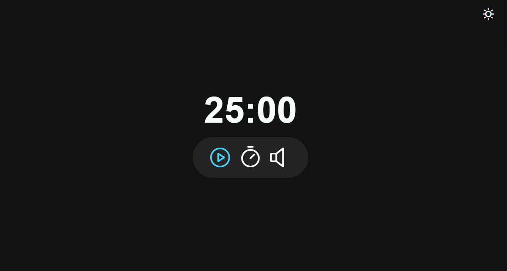
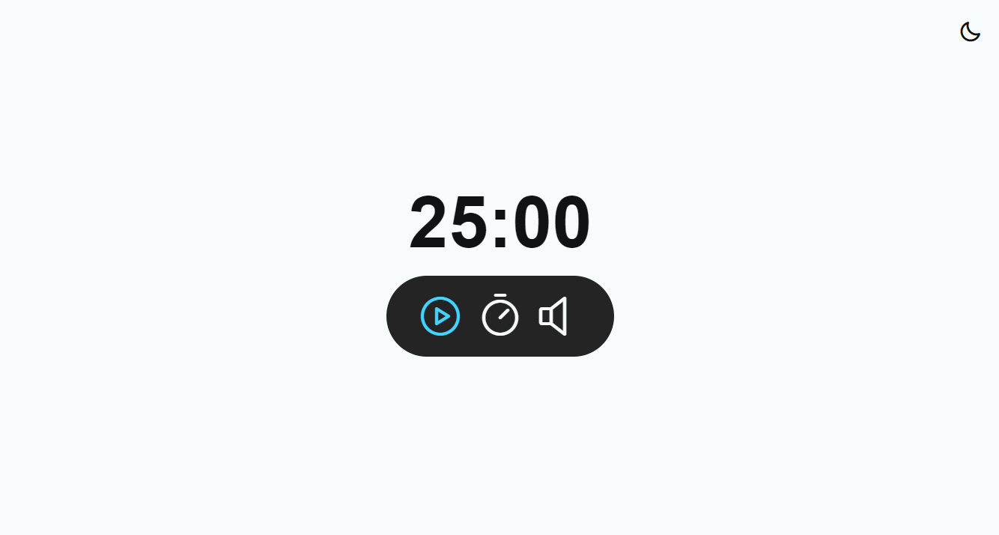

<h1 align="center">Projeto Focus Timer</h1>

  <a href="#-preview">Preview</a>&nbsp;&nbsp;&nbsp;|&nbsp;&nbsp;&nbsp;
  <a href="#-tecnologias">Tecnologias</a>&nbsp;&nbsp;&nbsp;|&nbsp;&nbsp;&nbsp;
  <a href="#-projeto">Projeto</a>&nbsp;&nbsp;&nbsp;|&nbsp;&nbsp;&nbsp;
  <a href="#-layout">Layout</a>

 

## 🖥 Preview

Dark mode  

 
Light mode  

## 🚀 Tecnologias

Esse projeto foi desenvolvido com as seguintes tecnologias:

- HTML
- CSS
- JavaScript
- Git e Github
- Figma

## 💻 Projeto

O projeto Focus Timer foi desenvolvido com o objetivo de criar um contador no estilo de pomodoro, para pessoas que gostam de gerir o seu tempo com esta ferramenta e melhorarem sua produtividade.
A contagem inicia-se por padrão em 25 minutos, com a funcionalidade de ativar uma música tranquila de fundo e, ao finalizar o tempo do timer desperta um alarme.

Principais conceitos trabalhados:
- Estilização de telas dark e light mode
- Acessibilidade para leitores de tela
- Manipulação da DOM
- Criação e interação de botões
- CSS not para remover botões da tela
- Sons acionados ao interagir com o timer
- ES6 Modules: Import/Export
- Validação de dados

## 🔖 Layout

Você pode visualizar o layout do projeto através [DESSE LINK](https://www.figma.com/design/TWGlyV4tsrXOOaAP97FWbK/Focus-Timer-V2-%E2%80%A2-Projeto-Explorer-(Community)?m=auto&t=iGMMlgG1YXGOLLIN-6), no Figma. 
designed by Rocketseat